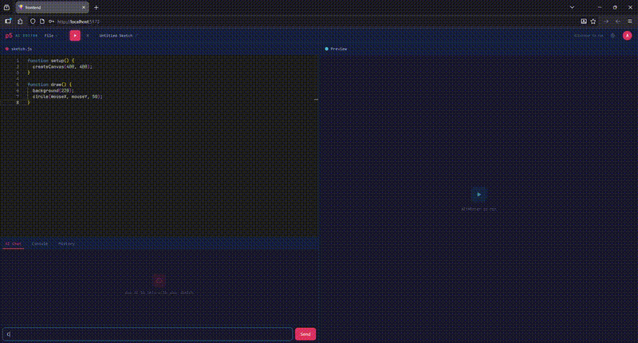

<div align="center">

# p5.js AI Editor

**AI-powered creative coding — generate and edit p5.js sketches with natural language.**

[](LICENSE)
[](https://www.typescriptlang.org/)
[](https://github.com/franpiaggio/p5-ai/pulls)

[Demo](#demo) · [Features](#features) · [Getting Started](#getting-started) · [Usage](#usage) · [Contributing](#contributing)

</div>

## Demo



## Features

- **AI Chat** — Generate and modify p5.js sketches through conversational prompts with real-time streaming
- **Multi-provider AI** — Choose between OpenAI (GPT-4o), Anthropic (Claude), or the free demo mode (Groq + Llama) with model selection for all providers
- **Monaco Editor** — Full-featured code editor with syntax highlighting, bracket matching, and error decorations
- **Live Preview** — Run sketches instantly with `Alt+Enter`; AI-suggested code auto-previews so you can see the result before accepting
- **Code Diff Review** — Review AI-suggested changes with a visual diff viewer — accept with `Ctrl+Enter` or reject with `Esc`
- **Code History** — Browse, compare, and restore previous versions of your code
- **Image Attachments** — Attach PNG/JPEG images to your chat messages (OpenAI and Anthropic providers)
- **Error Quick-Fix** — Click "Fix this" on runtime errors to automatically send them to the AI for a fix
- **Sketch Management** — Save, load, and organize sketches with cloud sync when authenticated
- **Authentication** — Google OAuth and local login with JWT-based session management

## Tech Stack

| Frontend | Backend |
|---|---|
| React 19 | NestJS 11 |
| Vite 7 | TypeORM + SQLite |
| TypeScript | OpenAI SDK |
| Monaco Editor | Anthropic SDK |
| Zustand | JWT Auth |
| Tailwind CSS 4 | Google OAuth |

## Getting Started

### Prerequisites

- [Node.js](https://nodejs.org/) 18+
- [pnpm](https://pnpm.io/) (frontend)
- npm 9+ (backend)

### Installation

1. **Clone the repository**

```bash
git clone https://github.com/franpiaggio/p5-ai.git
cd p5-ai
```

2. **Create a `.env` file in the project root:**

```env
JWT_SECRET=your-random-secret-key-at-least-32-chars
GOOGLE_CLIENT_ID=your-google-client-id.apps.googleusercontent.com
GROQ_API_KEY=your-groq-api-key   # Optional — enables free demo mode
ADMIN_PASSWORD=your-admin-password
```

> The backend reads `.env` from both the project root and the `backend/` directory.

3. **Install dependencies**

```bash
# Backend
cd backend
npm install

# Frontend
cd frontend
pnpm install
```

4. **Run both servers**

```bash
# Terminal 1 — Backend (http://localhost:3000)
cd backend
npm run start:dev

# Terminal 2 — Frontend (http://localhost:5173)
cd frontend
pnpm dev
```

### Docker

You can also run the full stack with Docker Compose:

```bash
docker compose up --build
```

## Usage

1. Write p5.js code in the editor or use the AI chat to generate it
2. Press `Alt+Enter` to run the sketch
3. Configure your AI provider and model in **Settings** (demo mode works out of the box)
4. AI-suggested code auto-previews in the canvas — review the diff and accept with `Ctrl+Enter` or reject with `Esc`
5. Browse your code history and restore previous versions at any time

### Keyboard Shortcuts

| Shortcut | Action |
|---|---|
| `Alt+Enter` | Run sketch |
| `Ctrl+S` | Save sketch |
| `Ctrl+Enter` | Accept code diff |
| `Esc` | Reject code diff |

## Contributing

Contributions are welcome! Feel free to open an [issue](https://github.com/franpiaggio/p5-ai/issues) or submit a [pull request](https://github.com/franpiaggio/p5-ai/pulls).

1. Fork the repository
2. Create your feature branch (`git checkout -b feature/my-feature`)
3. Commit your changes (`git commit -m 'Add my feature'`)
4. Push to the branch (`git push origin feature/my-feature`)
5. Open a Pull Request

## License

This project is licensed under the MIT License — see the [LICENSE](LICENSE) file for details.
