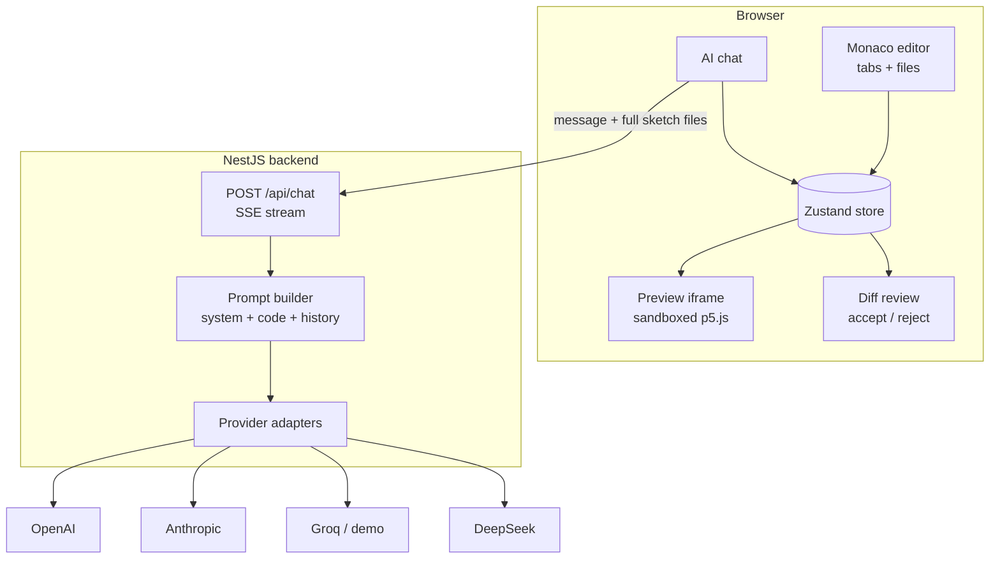
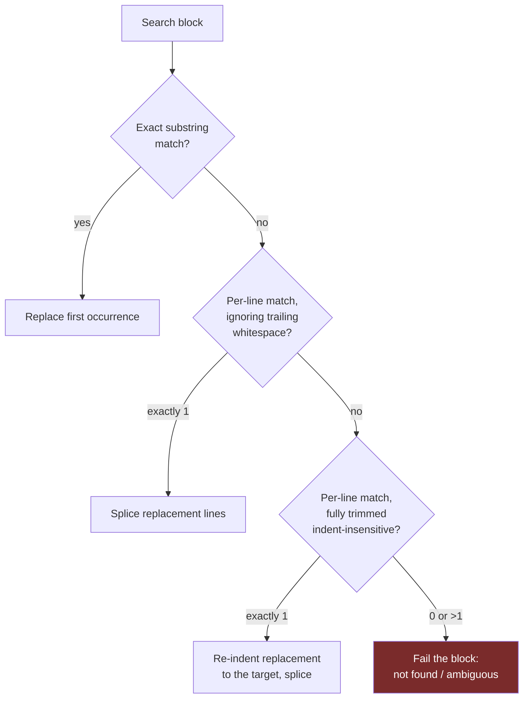
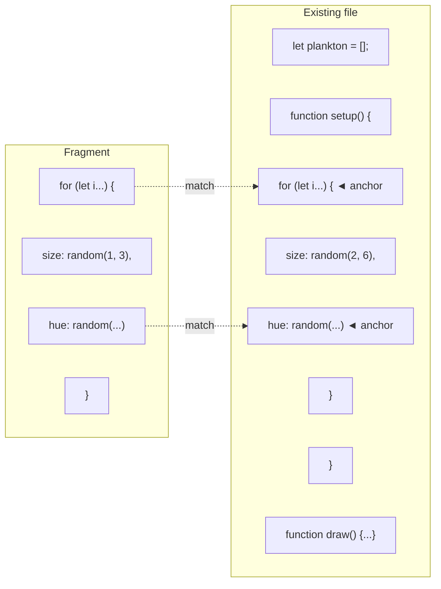
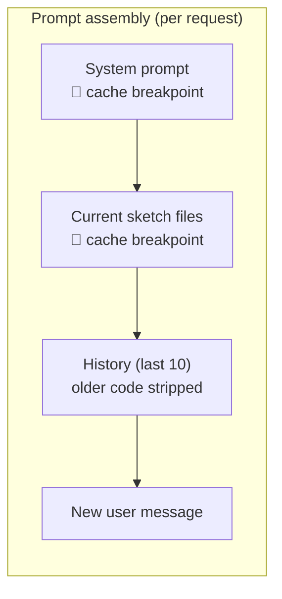
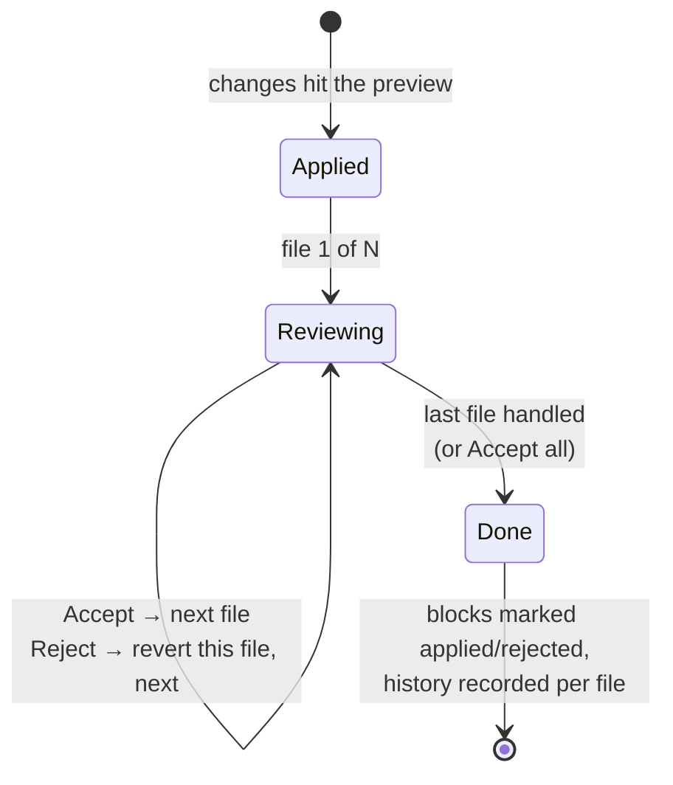

# Building a Cursor-like AI editor for p5.js

*An experiment in AI-assisted creative coding: what it takes to make an LLM
edit code reliably, cheaply, and with a review flow that doesn't get in the
way of play.*

> **Status: draft (v1.0 — condensed).** An expanded edition with sources and
> friendlier explanations exists as
> [v1.1 (annotated)](preview.html?post=1.1-building-a-cursor-like-editor-for-p5js-annotated).
> Companion article to
> [p5 AI Editor](https://github.com/franpiaggio) — a browser editor where you
> describe a change ("make the particles smaller", "shift the palette to teal")
> and it arrives as a reviewable diff over your running sketch.

---

## 1. The idea

Tools like Cursor and Copilot Edits proved that "describe the change, review a
diff" is the right interaction for AI-assisted coding. I wanted to explore that
interaction in the smallest domain where it shines: **p5.js sketches**.

Creative coding is a uniquely good sandbox for this experiment:

- **Instant visual feedback.** Every edit re-runs the sketch. You *see* whether
  the AI understood you — no test suite needed to judge the result.
- **Small, self-contained programs.** A sketch is one to a handful of files.
  The whole codebase fits in a single prompt, which sidesteps the hardest
  problem general AI editors have (retrieval / codebase context).
- **Forgiving stakes.** A wrong edit costs you a rectangle in the wrong place,
  not a production incident. Perfect for iterating on the *editing machinery*
  itself.

So the experiment is really two things at once: a fun creative-coding toy, and
a testbed for the techniques below — the same ones production AI editors use,
scaled down to where you can actually read all the code involved.

## 2. The system at a glance



The frontend holds the whole state (files, chat, history) in a Zustand store;
the backend is a thin streaming proxy that assembles the prompt and adapts to
each provider. Because sketches are small, **the full code goes into every
request** — no RAG, no embeddings. That choice makes everything downstream
simpler, and section 7 shows how to keep it from being expensive.

## 3. The core problem: how should an LLM edit code?

Every AI editor has to answer one question: *in what format does the model
express an edit?* The options form a triangle of trade-offs:

| Format | Reliability | Token cost | Latency |
|---|---|---|---|
| Full-file rewrite | High (nothing to match) | Worst — resends everything | Worst |
| Unified diff (line numbers) | Low — models hallucinate line numbers | Best | Best |
| **Search/replace blocks** | **High — anchored on content, not positions** | Good | Good |

Aider's public benchmarks landed on the same answer this project uses:
**search/replace blocks win**. Models are bad at counting lines but great at
quoting code they just read. Cursor takes a different route — a big model emits
a *lazy edit* ("`// ... existing code ...`") and a small fine-tuned **apply
model** merges it at ~1000 tokens/sec — but that requires training and serving
a second model. For an experiment, the interesting question is: *how far can
you get with prompt design + client-side merging alone?*

Quite far, it turns out. The rest of this post is the six techniques that make
it work.

## 4. Technique 1 — Two response formats, chosen by the model

The system prompt gives the model two ways to answer, and the decision rule:

```
### Format A — Full code (new sketches, major rewrites, >40% changes)
A single code block containing the COMPLETE file, first line to last.

### Format B — Search/replace blocks (small targeted edits)
<<<SEARCH
  background(240, 60, 8);
===
  background(200, 80, 15);
>>>REPLACE
```

Format B is the star: a one-line color tweak costs ~30 output tokens instead of
resending a 300-line sketch. Format A remains for genuine rewrites, where a
patch format would degenerate into one giant block anyway.

Two prompt details that matter more than they look:

- **"The SEARCH text must match EXACTLY"** — and yet it won't, reliably.
  Technique 2 exists because models drift on whitespace.
- **"A code block must contain the COMPLETE file"** — and yet it won't, always.
  Technique 3 exists because weaker models send fragments anyway. Prompts set
  the happy path; the client assumes betrayal.

## 5. Technique 2 — Cascading match tolerance

The naive implementation of search/replace is `indexOf`. It fails the moment
the model remembers `background(30);` but your file has a trailing space, and
every failure degrades into a full-file fallback — you lose the token savings
exactly when you wanted them.

The fix is a cascade, applied per block:



Two design decisions worth stealing:

- **Uniqueness is required at the fuzzy tiers.** An exact match takes the first
  occurrence (the model usually includes disambiguating context), but a fuzzy
  match that hits two places *refuses to guess*. A wrong-location edit is worse
  than no edit.
- **Re-indentation on the trimmed tier.** If the model wrote the block with
  2-space indent and your file uses 6, the replacement is shifted to the
  target's indentation — the file stays consistent even though the model's
  memory of it wasn't.

## 6. Technique 3 — The lazy fragment problem

The failure that motivated the most interesting code in the project: ask a
weak model for "smaller particles" and it answers with a code block containing
*only the loop it changed*. Treat that as a full file (Format A) and you just
deleted `setup()`, `draw()` and everything else. This actually happened —
one keystroke turned a working sketch into two `ReferenceError`s.

Cursor solves this class of problem with its apply model. A heuristic
client-side version gets surprisingly close:

**Detection.** A block claiming to replace a file is a fragment if:

- its first non-empty line is indented (no complete file starts mid-scope), or
- it targets the entry file but doesn't declare `function setup()` — every
  complete sketch has one, or
- it targets a helper file, is under half its size, and re-declares none of the
  file's top-level symbols (a legitimate rewrite or rename keeps similar size).

**Anchor merging.** Once detected, don't reject the edit — *place* it:



Fragment lines that appear **exactly once** in the file (compared trimmed)
become anchors. If at least two anchors map onto the file *in order*, the
spanned region is replaced by the fragment — the one-line change lands as a
one-line diff, and `draw()` survives. No safe anchoring? The change is dropped
entirely: a no-op beats a wipeout, and the suggestion is still visible in chat.

## 7. Technique 4 — Token economics

Sending the full sketch every turn is only viable if you stop paying full price
for it. Three measures, in order of impact:

| Measure | What it does | Cost effect |
|---|---|---|
| **History code-stripping** | Older assistant messages get their code blocks replaced by `[previous code omitted — the current sketch code above already includes every applied change]`. The newest one stays intact so "apply what you just suggested" keeps its referent. | The same sketch stops appearing 4-5× per request |
| **Prompt caching** (Anthropic) | Two `cache_control` breakpoints: the static system prompt (always hits) and the code-context message (hits while the sketch is unchanged between turns) | ~90% off the cached prefix |
| **Predicted Outputs** (OpenAI) | The current code is passed as `prediction` — a full rewrite is a near-copy of it, so the API speculatively decodes against it | 2-4× lower latency on rewrites |



One honest caveat: rejected prediction tokens bill at output rates, so
Predicted Outputs is a bet that pays off on edit-heavy sessions and costs a
little on chat-heavy ones. It's also gated to the model families that accept
the parameter — sending it elsewhere fails the whole request.

## 8. Technique 5 — Multi-file sketches and per-file review

Sketches outgrow one file fast (a `Particle` class here, a palette there), and
multi-file edits raise two questions the single-file flow never faced.

**Where does an edit land?** Search/replace blocks carry an optional
`// filename:` prefix. When it's missing, the target is resolved *by content*:
whichever file actually contains the SEARCH text (active file first, then the
entry, then any unique match). The model can't know which file you're looking
at — but the text it quotes identifies the file on its own.

**How do you review an edit that spans three files?** The same way Cursor
does: apply everything to the live preview immediately (you want to *see* the
result), then step through each file's diff:



Rejecting a file reverts *only that file* (a rejected new file is deleted
again); accepting records a per-file history entry you can restore later. The
preview shows the full proposed result the whole time — review is a visual
decision, not an act of faith.

## 9. Technique 6 — Streaming without burning the client

Two client-side details that keep the experience smooth:

- **Live diff while streaming.** As search/replace blocks stream in, they're
  applied *leniently* (skip what doesn't match yet) against the file on screen,
  and Monaco renders the in-progress diff. You watch the edit grow.
- **Throttled parsing.** The naive loop re-parses the entire accumulated
  response and re-renders the diff on *every token* — O(n²) over the response.
  Chunks arrive every few milliseconds; human eyes don't. One parse+render per
  80 ms (first chunk immediate, final state flushed atomically after the
  stream) removes the quadratic cost without touching perceived liveness.

## 10. What I learned

1. **Prompts propose, clients dispose.** Every format rule in the system
   prompt is violated by some model some day. The reliability came from
   client-side machinery — cascading matching, fragment detection, anchor
   merging — that assumes the model got it *almost* right.
2. **Refusing is a feature.** The two best-received behaviors are refusals:
   ambiguous fuzzy matches that decline to guess, and unmergeable fragments
   that decline to apply. In an editor, wrong-and-confident is the only fatal
   failure mode.
3. **p5.js is a great harness for this research.** Instant visual verification
   turns every user interaction into an eval. When the AI misplaces an edit,
   you don't read a stack trace — you watch the wrong thing rotate.

**Next:** reporting failed search/replace blocks back to the model for a
targeted retry (Aider does this), and measuring how often each cascade tier and
the fragment guard actually fire in real sessions.

---

*Built with React + Monaco + NestJS. The editing machinery described here is
~600 lines of plain TypeScript — small enough to read in one sitting, which
was the point of the experiment.*
