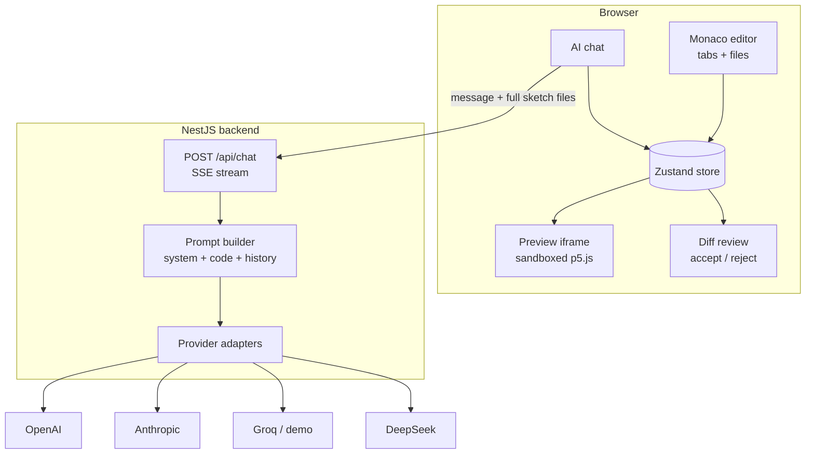
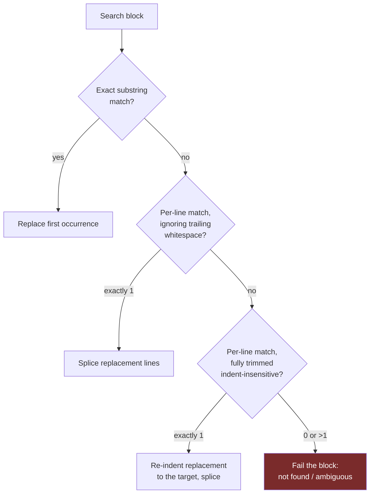
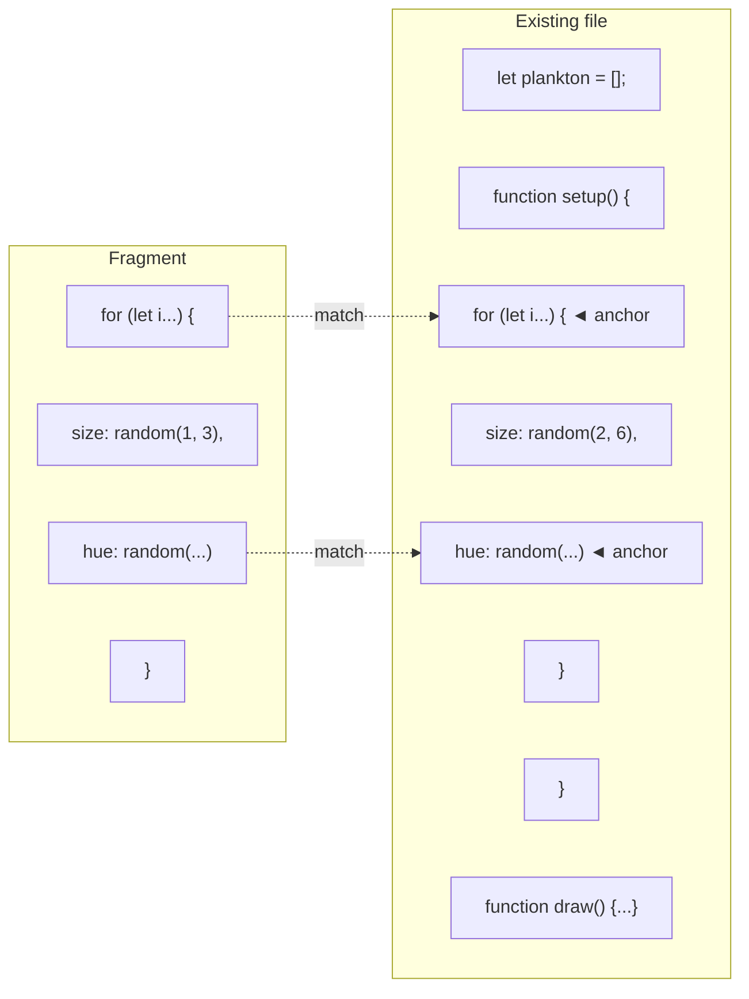
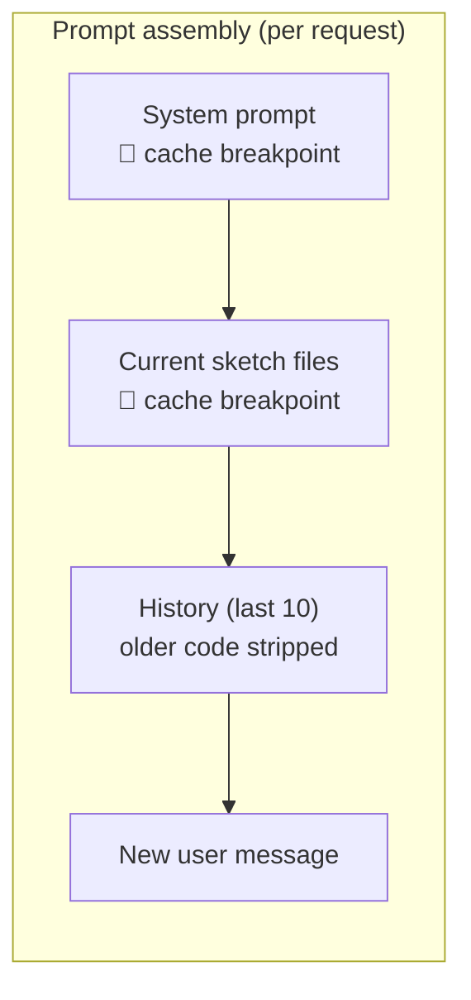
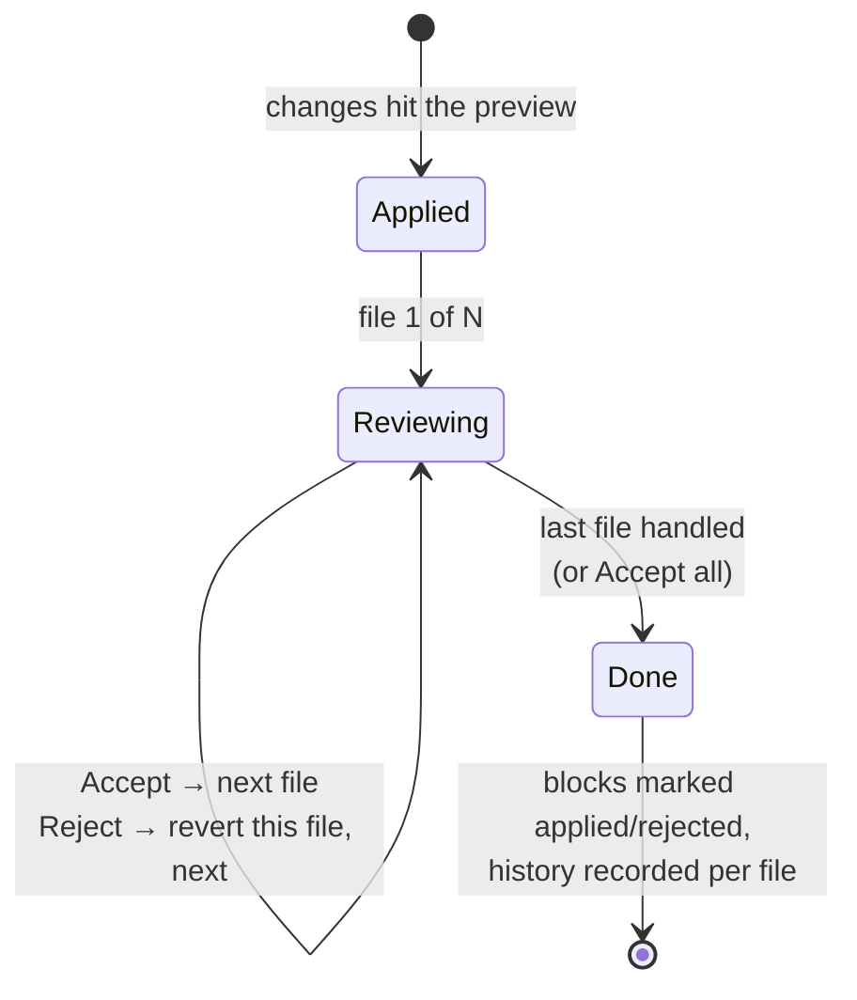

# Building a Cursor-like AI editor for p5.js (annotated edition)

*An experiment in AI-assisted creative coding: what it takes to make an LLM
edit code reliably, cheaply, and with a review flow that doesn't get in the
way of play. This is the expanded edition of [v1.0](preview.html?post=1.0-building-a-cursor-like-editor-for-p5js) —
same ideas, told with more patience, and with sources for every claim.*

> **Status: draft (v1.1 — annotated).** Superseded by
> [v1.2 (illustrated)](preview.html?post=1.2-building-a-cursor-like-editor-for-p5js-illustrated),
> which adds app screenshots and a prose rewrite. Companion article to
> [p5 AI Editor](https://github.com/franpiaggio) — a browser editor where you
> describe a change ("make the particles smaller", "shift the palette to teal")
> and it arrives as a reviewable diff over your running sketch.

---

## 1. The idea

If you've used [Cursor](https://cursor.com) or GitHub's
[Copilot Edits](https://github.blog/news-insights/product-news/github-copilot-the-agent-awakens/),
you know the interaction: you describe a change in plain language, and instead
of a wall of chat text you get a **diff** — green lines in, red lines out —
that you accept or reject. It feels less like talking to a chatbot and more
like pair programming with someone who types very fast.

I wanted to understand how that interaction actually works under the hood. Not
by reading about it — by building it. And rather than building it for
general-purpose programming (a hard problem that companies raise millions to
attack), I picked the smallest domain where the interaction shines:
**[p5.js](https://p5js.org) sketches**.

Why creative coding, specifically? Three properties make it an unusually good
laboratory:

- **Instant visual feedback.** Every edit re-runs the sketch. You *see*
  whether the AI understood you — no test suite, no code review, no deploy.
  If you asked for smaller particles and the particles got smaller, it worked.
  If the canvas went blank, it didn't. The feedback loop is seconds long and
  requires zero expertise to evaluate.
- **Small, self-contained programs.** A sketch is one to a handful of files,
  a few hundred lines total. The whole codebase fits in a single prompt. This
  quietly removes the *hardest* problem general AI editors face — figuring out
  which parts of a large codebase to show the model (retrieval, embeddings,
  codebase indexing) — and lets you focus purely on the *editing* machinery.
- **Forgiving stakes.** A wrong edit costs you a rectangle in the wrong place,
  not a production incident. That freedom to break things is exactly what you
  want while iterating on the editing pipeline itself.

So the experiment is really two things at once: a fun creative-coding toy, and
a scaled-down testbed for the same techniques production AI editors use —
small enough that all the interesting code is ~600 lines you can read in one
sitting.

## 2. The system at a glance

Before the techniques, the shape of the thing:



The frontend is React with the
[Monaco editor](https://microsoft.github.io/monaco-editor/) (the editor that
powers VS Code) and a [Zustand](https://zustand-demo.pmnd.rs/) store holding
everything: files, chat history, undo history. The p5.js preview runs in a
sandboxed iframe. The backend is a thin
[NestJS](https://nestjs.com) proxy: it assembles the prompt, adapts it to each
provider's API, and streams the response back over
[Server-Sent Events](https://developer.mozilla.org/en-US/docs/Web/API/Server-sent_events).

One architectural decision drives everything else: because sketches are small,
**the full code goes into every request**. No RAG, no embeddings, no "which
files are relevant" heuristics. That sounds wasteful — and naively, it is —
but it makes every downstream problem simpler, and section 7 shows how caching
and history-stripping bring the cost back down.

## 3. The core problem: how should an LLM edit code?

Here is the question every AI editor has to answer, and it's more interesting
than it sounds: *in what format does the model express an edit?*

The model can't reach into your editor and move a cursor. It can only emit
text. So you need a contract: "when you want to change the code, say it like
*this*, and I'll apply it." The candidate contracts form a triangle of
trade-offs:

| Format | Reliability | Token cost | Latency |
|---|---|---|---|
| Full-file rewrite | High (nothing to match) | Worst — resends everything | Worst |
| Unified diff (line numbers) | Low — models hallucinate line numbers | Best | Best |
| **Search/replace blocks** | **High — anchored on content, not positions** | Good | Good |

**Full-file rewrite** is what raw ChatGPT does: "here's your whole file with
the change." Trivially reliable, painfully slow and expensive once the file
grows — you're paying for 300 lines of output to change one.

**Unified diffs** (the `@@ -12,4 +12,6 @@` format `git` uses) are compact,
but they lean on line numbers, and LLMs are *notoriously* bad at counting
lines. Aider's benchmark work found models frequently produce diffs with
slightly-off line numbers and malformed hunks — close, but "close" doesn't
apply cleanly ([Aider: unified diffs](https://aider.chat/2023/12/21/unified-diffs.html)).

**Search/replace blocks** are the middle path:

> "Find this exact snippet, replace it with this one."

No positions, no counting — just quoting. And quoting code they just read is
something LLMs are *great* at. Aider's public
[edit-format benchmarks](https://aider.chat/docs/benchmarks.html) landed on
search/replace as the most reliable practical format, and it's what this
project uses.

Cursor takes a different route worth knowing about: their main model emits a
*lazy edit* — a sketch of the change with `// ... existing code ...` markers —
and a separate, small, fine-tuned **apply model** merges it into the real file
at ~1000 tokens/sec
([Cursor: Near-instant full-file edits](https://cursor.com/blog/instant-apply)).
That's the industrial solution: train a second model whose only job is
merging. For a solo experiment, the interesting question becomes: *how far can
you get with prompt design and client-side merging alone — zero custom
models?*

Quite far, it turns out. The rest of this post is the six techniques that
close the gap.

## 4. Technique 1 — Two response formats, chosen by the model

The system prompt gives the model two ways to answer, and — crucially — the
decision rule for choosing between them:

```
### Format A — Full code (new sketches, major rewrites, >40% changes)
A single code block containing the COMPLETE file, first line to last.

### Format B — Search/replace blocks (small targeted edits)
<<<SEARCH
  background(240, 60, 8);
===
  background(200, 80, 15);
>>>REPLACE
```

Format B is the star. A one-line color tweak costs ~30 output tokens instead
of resending a 300-line sketch — a ~95% reduction on the most common kind of
request. Format A stays available for genuine rewrites ("start over with a
flow field"), where a patch format would degenerate into one giant
search/replace block covering the whole file anyway.

Why let the *model* choose? Because it's the only party that knows the scope
of the change before writing it. The prompt gives it a threshold (roughly:
patches under ~40% of the file, rewrite above) and in practice models follow
it well.

Two prompt details matter more than they look:

- **"The SEARCH text must match EXACTLY."** It won't, reliably. Models
  reconstruct code from attention over a long context, and they drift —
  trailing whitespace, indentation, a stray semicolon. Technique 2 exists
  because of this.
- **"A code block must contain the COMPLETE file."** It won't, always.
  Weaker models send fragments no matter how many capital letters you use.
  Technique 3 exists because of that.

The design stance underneath both: **prompts set the happy path; the client
assumes betrayal.** Prompt instructions are wishes, not guarantees, and
reliability has to come from the code that receives the response.

## 5. Technique 2 — Cascading match tolerance

The naive implementation of search/replace is `indexOf`: find the SEARCH text,
splice in the REPLACE text. It works in demos and fails in week one, the
moment the model remembers `background(30);` but your file has a trailing
space after it. And every match failure is expensive: the edit silently
doesn't apply, the user re-asks, and you've lost the token savings exactly
when you wanted them.

The fix — borrowed in spirit from how
[Aider's matching evolved](https://aider.chat/docs/benchmarks.html) — is a
cascade of increasingly tolerant matching tiers, applied per block:



Tier 1 is the fast exact path. Tier 2 forgives trailing whitespace — the most
common drift. Tier 3 compares lines fully trimmed, forgiving indentation
entirely. Each tier catches a real failure mode observed in actual model
output.

Two design decisions worth stealing:

- **Uniqueness is required at the fuzzy tiers.** An exact match takes the
  first occurrence (the model usually quotes enough surrounding context to be
  unambiguous). But a *fuzzy* match that hits two different places in the file
  refuses to guess and fails the block instead. The reasoning: an edit applied
  in the wrong location is far worse than an edit that visibly didn't apply.
  One corrupts the sketch quietly; the other is an obvious "that didn't work,
  try again."
- **Re-indentation on the trimmed tier.** If the model wrote the block with
  2-space indentation and your file uses 6, the replacement lines are shifted
  to match the target's actual indentation before splicing. The file stays
  consistent even though the model's memory of it wasn't.

## 6. Technique 3 — The lazy fragment problem

This one earned its place through a real incident. Ask a small demo model for
"smaller particles" and it answers with a code block containing *only the loop
it changed* — no `setup()`, no `draw()`, just the fragment it was thinking
about. The client, following the contract, treated it as Format A — a full
file — and replaced the entire sketch with four lines. One keystroke turned a
working sketch into two `ReferenceError`s.

(The user recovered from the built-in history — but "the undo button saved us"
is not a defense strategy.)

This is exactly the problem class Cursor's apply model was trained for:
merging a partial sketch of an edit into the real file
([Cursor: instant apply](https://cursor.com/blog/instant-apply)). A heuristic,
client-side version gets surprisingly close. It has two halves.

**Detection.** A code block claiming to replace a file is flagged as a
fragment if any of these hold:

- its first non-empty line is **indented** — no complete file starts
  mid-scope;
- it targets the entry file but never declares `function setup()` — every
  complete p5.js sketch has one (`draw()` is deliberately not required:
  a static sketch legitimately has only `setup()`);
- it targets a helper file (say, a `Particle` class), is **under half the
  file's current size**, and re-declares **none of the file's top-level
  symbols** — a legitimate rewrite keeps roughly the same shape; a fragment
  keeps neither the size nor the declarations.

**Anchor merging.** Once a fragment is detected, the interesting move is to
*not* reject it — the model's edit is usually correct, just incomplete. So the
client tries to *place* it:



Fragment lines that appear **exactly once** in the file (compared trimmed)
become anchors — unique landmarks that pin the fragment to a location. If at
least two anchors map onto the file *in the same order* they appear in the
fragment, the spanned region of the file is replaced by the fragment. The
one-line change lands as a one-line diff, and `draw()` survives.

And if no safe anchoring exists? The change is dropped entirely. A no-op beats
a wipeout: the suggestion is still fully visible in the chat, and the user can
apply it by hand or re-ask. This mirrors the cascade's philosophy — when the
system isn't sure, it declines loudly rather than guessing quietly.

## 7. Technique 4 — Token economics

Sending the full sketch on every turn is only viable if you stop paying full
price for it. Left naive, a 10-turn conversation resends the same code ~10
times, and each assistant reply that quoted code gets re-sent inside the
history too — the same lines can appear five times *in a single request*.
Three measures, in order of impact:

| Measure | What it does | Cost effect |
|---|---|---|
| **History code-stripping** | Older assistant messages get their code blocks replaced by `[previous code omitted — the current sketch code above already includes every applied change]`. The newest one stays intact so "apply what you just suggested" keeps its referent. | The same sketch stops appearing 4-5× per request |
| **Prompt caching** ([Anthropic](https://docs.anthropic.com/en/docs/build-with-claude/prompt-caching)) | Two `cache_control` breakpoints: one after the static system prompt (always hits) and one after the code-context message (hits while the sketch is unchanged between turns). Cached prefix tokens bill at ~10% of the base input rate. | ~90% off the cached prefix |
| **Predicted Outputs** ([OpenAI](https://platform.openai.com/docs/guides/predicted-outputs)) | The current code is passed as a `prediction` — a full rewrite is a near-copy of it, so the API speculatively decodes against the prediction instead of generating token by token | 2-4× lower latency on rewrites |



The ordering in that diagram is the whole trick of prompt caching: caching
works on a **stable prefix**, so the prompt is assembled most-stable-first.
The system prompt never changes; the sketch changes only when you edit it;
history changes every turn. Put them in that order and the expensive parts sit
inside the cached region.

One honest caveat on Predicted Outputs: rejected prediction tokens bill at
output-token rates, so it's a bet that pays off on edit-heavy sessions and
costs a little on chat-heavy ones. It's also gated to the model families that
accept the parameter — sending it to a model that doesn't support it fails the
whole request, so the client checks the model name first.

## 8. Technique 5 — Multi-file sketches and per-file review

Sketches outgrow one file fast — a `Particle` class here, a palette module
there — and multi-file edits raise two questions the single-file flow never
faced.

**Where does an edit land?** Search/replace blocks carry an optional
`// filename:` prefix line. But models omit it, so when it's missing the
target is resolved **by content**: whichever file actually contains the
SEARCH text — checking the active file first, then the entry file, then any
file with a unique match. The insight: the model can't know which file you're
*looking at*, but the code it quotes identifies the file on its own. The
quote *is* the address.

**How do you review an edit that spans three files?** Stepping through three
separate diffs before seeing anything move would kill the creative loop. So
it works the way Cursor's multi-file edits do: apply everything to the live
preview **immediately** (you want to *see* the result — that's the whole
point of the medium), then step through each file's diff at your own pace:



Rejecting a file reverts *only that file* (a rejected brand-new file is
deleted again); accepting records a per-file history entry you can restore
later. The preview shows the full proposed result the whole time — review
becomes a visual decision ("do I like what I'm seeing?"), not an act of faith
in a diff.

## 9. Technique 6 — Streaming without burning the client

LLM responses arrive as a stream of small chunks, several per second. Two
client-side details keep that experience smooth:

- **Live diff while streaming.** As search/replace blocks stream in, they're
  applied *leniently* — blocks that don't match yet (because they're still
  half-arrived) are simply skipped — against the file on screen, and Monaco
  renders the in-progress diff. You watch the edit take shape instead of
  staring at a spinner.
- **Throttled parsing.** The naive streaming loop re-parses the entire
  accumulated response and re-renders the diff on *every chunk* — that's
  O(n²) work over the response length, and it burns CPU precisely while the
  p5.js preview is trying to animate at 60fps. But chunks arrive every few
  milliseconds and human eyes don't: one parse+render per **80 ms** (first
  chunk immediate so the UI reacts instantly, final state flushed atomically
  after the stream ends) removes the quadratic cost without touching
  perceived liveness.

## 10. What I learned

1. **Prompts propose, clients dispose.** Every format rule in the system
   prompt is violated by some model some day. The reliability came from
   client-side machinery — cascading matching, fragment detection, anchor
   merging — that assumes the model got it *almost* right and closes the last
   millimeter itself.
2. **Refusing is a feature.** The two best-received behaviors in the whole
   project are refusals: ambiguous fuzzy matches that decline to guess, and
   unmergeable fragments that decline to apply. In an editor, wrong-and-
   confident is the only fatal failure mode; visibly-declined is just a retry.
3. **p5.js is a great harness for this research.** Instant visual verification
   turns every user interaction into an eval. When the AI misplaces an edit,
   you don't read a stack trace — you watch the wrong thing rotate.

**Next:** reporting failed search/replace blocks back to the model for a
targeted retry (Aider does this), and instrumenting how often each cascade
tier and the fragment guard actually fire in real sessions.

---

## Sources & further reading

- **Aider — edit format benchmarks.** Why search/replace beats other formats
  in practice, measured across models:
  [aider.chat/docs/benchmarks.html](https://aider.chat/docs/benchmarks.html)
- **Aider — unified diffs experiment.** What happens when you ask LLMs for
  git-style diffs (spoiler: hallucinated line numbers):
  [aider.chat/2023/12/21/unified-diffs.html](https://aider.chat/2023/12/21/unified-diffs.html)
- **Cursor — near-instant full-file edits.** The lazy-edit + fine-tuned apply
  model architecture, with speculative-decoding speedups:
  [cursor.com/blog/instant-apply](https://cursor.com/blog/instant-apply)
- **Anthropic — prompt caching.** How `cache_control` breakpoints work and
  what cached tokens cost:
  [docs.anthropic.com/en/docs/build-with-claude/prompt-caching](https://docs.anthropic.com/en/docs/build-with-claude/prompt-caching)
- **OpenAI — Predicted Outputs.** Speculative decoding against a known likely
  output: [platform.openai.com/docs/guides/predicted-outputs](https://platform.openai.com/docs/guides/predicted-outputs)
- **p5.js** — the creative-coding library this is all in service of:
  [p5js.org](https://p5js.org)
- **Monaco Editor** — VS Code's editor as a component:
  [microsoft.github.io/monaco-editor](https://microsoft.github.io/monaco-editor/)
- **jsdiff** — the line-diffing library behind the change summaries:
  [github.com/kpdecker/jsdiff](https://github.com/kpdecker/jsdiff)

---

*Built with React + Monaco + NestJS. The editing machinery described here is
~600 lines of plain TypeScript — small enough to read in one sitting, which
was the point of the experiment.*
