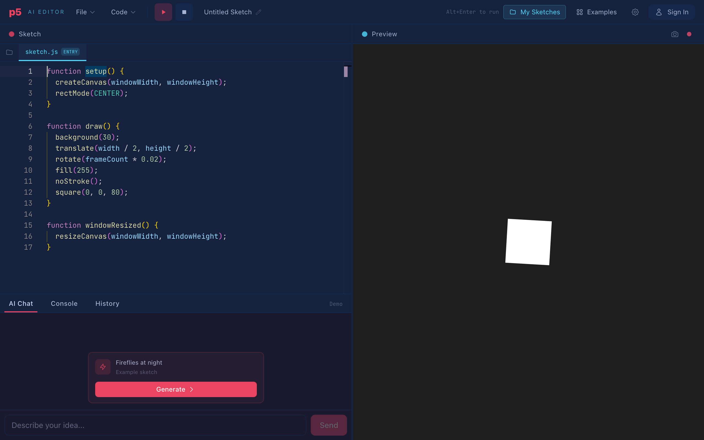
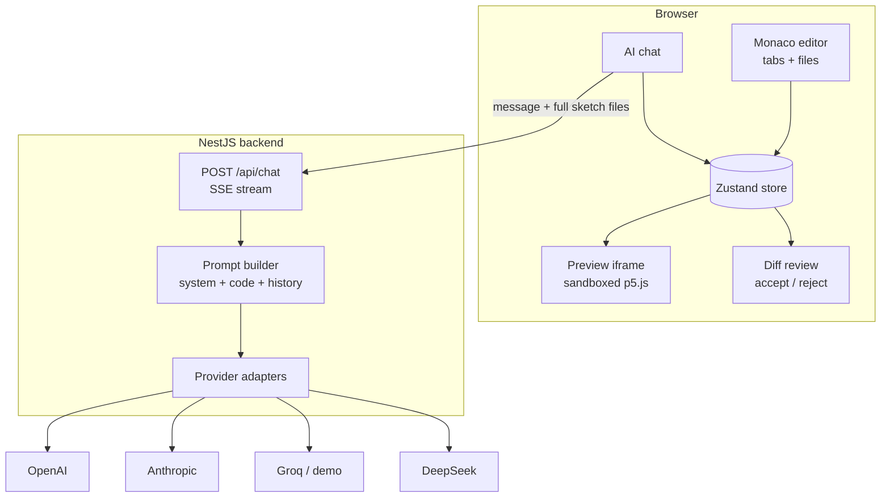
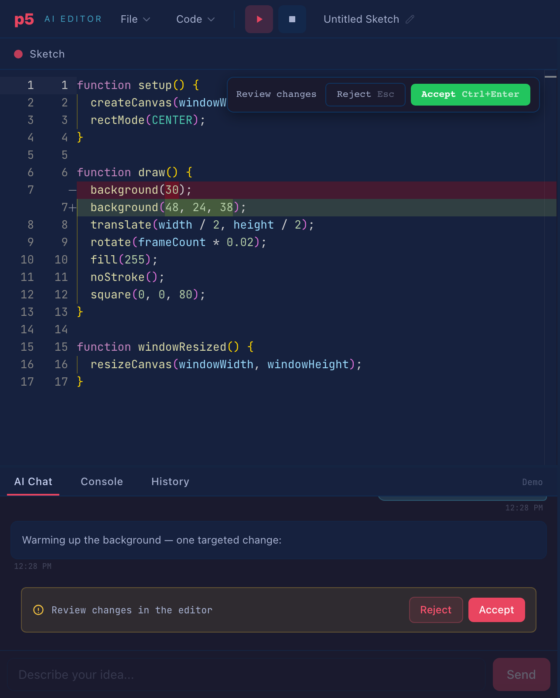
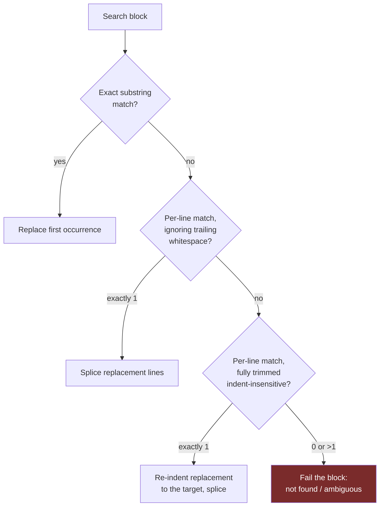
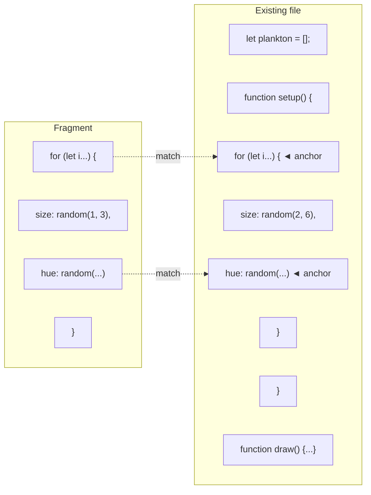
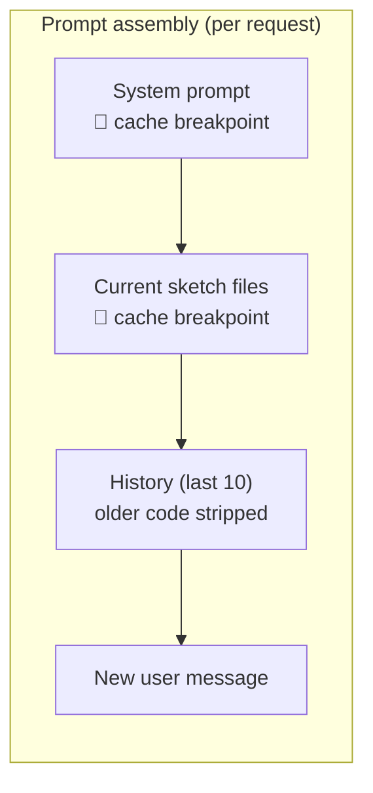
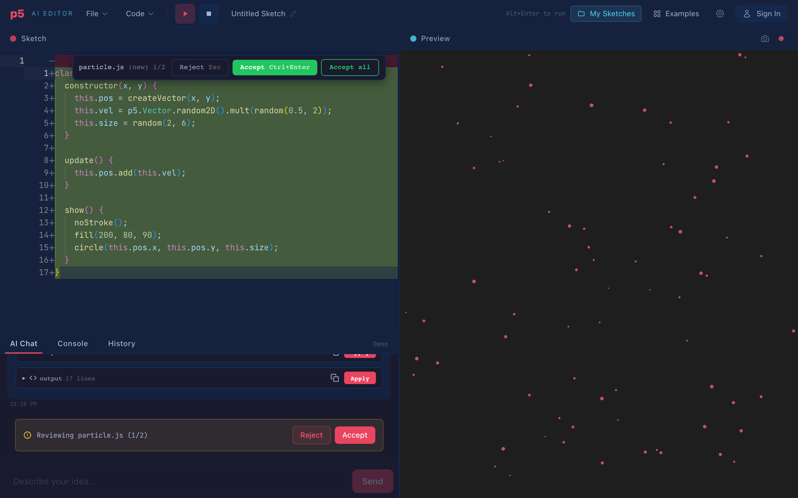
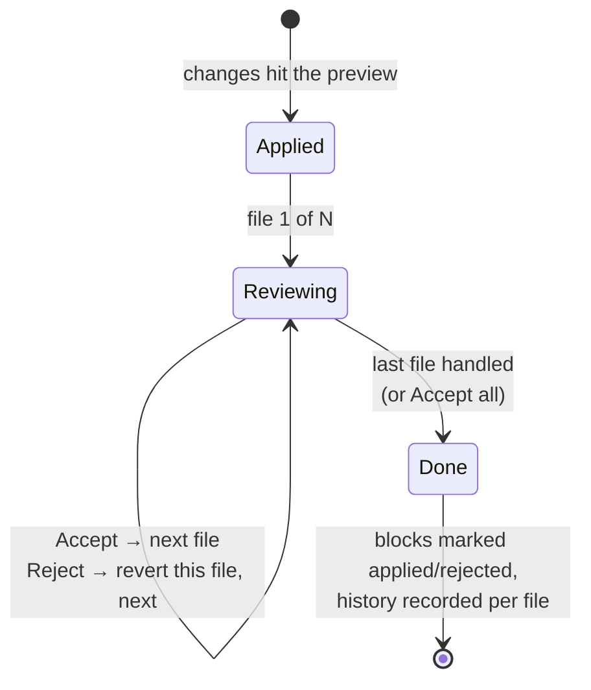

# Building a Cursor-like AI editor for p5.js

*What it took to make an LLM edit code reliably and cheaply in a small
creative-coding editor, with a review flow that stays out of the way. This is
v1.2: same material as the
[annotated edition](preview.html?post=1.1-building-a-cursor-like-editor-for-p5js-annotated),
rewritten, with screenshots of the actual app.*

> **Status: draft (v1.2 — illustrated).** Companion article to
> [p5 AI Editor](https://github.com/franpiaggio), a browser editor where you
> describe a change ("make the particles smaller", "shift the palette to
> teal") and it comes back as a reviewable diff over your running sketch.

---

## 1. Why p5.js

If you have used [Cursor](https://cursor.com) or GitHub's
[Copilot Edits](https://github.blog/news-insights/product-news/github-copilot-the-agent-awakens/),
you know the interaction: you describe a change in plain language and, instead
of a wall of chat text, you get a diff. Green lines in, red lines out, accept
or reject. I wanted to understand how that works under the hood, and reading
about it wasn't going to be enough. I had to build one.

I didn't want to build it for general-purpose programming, though. That
version of the problem is dominated by a question I find less interesting:
how do you decide which parts of a large codebase to show the model? Whole
companies exist to answer it. So I picked a domain where the question
disappears: **[p5.js](https://p5js.org) sketches**.

Creative coding turns out to be a good laboratory for this. A sketch is one
file, maybe a handful, a few hundred lines in total; the entire codebase fits
in a single prompt, so there is no retrieval problem at all. Feedback is
immediate and visual: if you asked for smaller particles and the particles got
smaller, it worked, and you can tell without reading a line of the diff. And
when an edit goes wrong, the cost is a rectangle in the wrong place rather
than a production incident. You can afford to break things while you iterate
on the editing machinery itself, which is the part I actually cared about.

The result is two things at once: a small creative-coding tool that is fun to
use, and a scaled-down testbed for the same techniques the production AI
editors use. All the interesting code adds up to about 600 lines of plain
TypeScript. You can read it in a sitting.

## 2. What the thing is

Here is the app: Monaco (the editor inside VS Code) on the left, the running
sketch on the right, chat below.



And the architecture behind it:



The frontend holds all the state (files, chat, undo history) in a
[Zustand](https://zustand-demo.pmnd.rs/) store. The p5.js preview runs in a
sandboxed iframe. The backend is a thin [NestJS](https://nestjs.com) proxy
that assembles the prompt, adapts it to each provider's API, and streams the
response back over
[Server-Sent Events](https://developer.mozilla.org/en-US/docs/Web/API/Server-sent_events).

One early decision shaped everything after it: since sketches are small, the
full code goes into every single request. No RAG, no embeddings, no relevance
heuristics. Naively this is wasteful, and section 7 is about why it doesn't
have to be, but it buys a great deal of simplicity everywhere else.

## 3. How should a model edit code?

A language model cannot reach into your editor and move the cursor. It can
only emit text. So you need a contract between you and the model: when you
want to change the code, express the change in this format, and I will apply
it. Choosing that format is the central design problem of any AI editor, and
the candidates trade off against each other:

| Format | Reliability | Token cost | Latency |
|---|---|---|---|
| Full-file rewrite | High (nothing to match) | Worst — resends everything | Worst |
| Unified diff (line numbers) | Low — models hallucinate line numbers | Best | Best |
| **Search/replace blocks** | **High — anchored on content, not positions** | Good | Good |

A full-file rewrite is what raw ChatGPT gives you: the whole file again, with
the change somewhere inside. Nothing can fail to apply, but you pay for 300
lines of output to change one, and you wait for all of them.

Unified diffs, the `@@ -12,4 +12,6 @@` format git uses, are compact but lean
on line numbers, and models are unreliable at counting lines. Aider's
experiments found that models produce diffs with slightly wrong numbers and
malformed hunks often enough to matter; close, but a diff that is close does
not apply
([Aider: unified diffs](https://aider.chat/2023/12/21/unified-diffs.html)).

Search/replace blocks sit in the middle: find this exact snippet, replace it
with this one. No positions and no counting, only quoting, and quoting code
they just read is something models do well. Aider's public
[benchmarks](https://aider.chat/docs/benchmarks.html) settled on this format
as the most reliable in practice, and it is what this project uses too.

Cursor went a different way, and it is worth knowing what you are choosing
not to do. Their main model emits a lazy edit, a sketch of the change with
`// ... existing code ...` markers, and a separate small model, fine-tuned
for exactly this job, merges it into the real file at around a thousand
tokens per second
([Cursor: near-instant full-file edits](https://cursor.com/blog/instant-apply)).
That is the industrial answer: train a second model whose only task is
merging. My question for this project was how far prompt design plus
client-side merging can go without any custom model. The answer turned out to
be: further than I expected. The next six sections are the techniques that
got it there.

## 4. Technique 1 — Two response formats, chosen by the model

The system prompt offers the model two ways to answer, along with the rule
for choosing:

```
### Format A — Full code (new sketches, major rewrites, >40% changes)
A single code block containing the COMPLETE file, first line to last.

### Format B — Search/replace blocks (small targeted edits)
<<<SEARCH
  background(240, 60, 8);
===
  background(200, 80, 15);
>>>REPLACE
```

Format B does most of the work day to day. A one-line color tweak costs about
30 output tokens instead of a 300-line resend. Format A stays available for
genuine rewrites ("start over with a flow field"), where a patch format would
collapse into one enormous block covering the whole file anyway.

The model picks the format because the model is the only party that knows the
scope of the change before writing it. The prompt gives it a threshold,
roughly: patch below 40% of the file, rewrite above. Models follow it well.

This is what a search/replace block looks like by the time the user sees it.
The raw block never appears in chat; it lands directly in the editor as an
inline diff, with the preview already showing the proposed result:



Two lines in that prompt deserve a closer look, because both are lies of a
sort.

"The SEARCH text must match EXACTLY." It won't, not reliably. Models
reconstruct code from attention over a long context and they drift: trailing
whitespace, indentation, a stray semicolon. Technique 2 exists because of
this.

"A code block must contain the COMPLETE file." Also not always true, no
matter how firmly you phrase it. Weaker models send fragments anyway.
Technique 3 exists because of that.

The stance I ended up with: the prompt defines the happy path, and the client
assumes the model got things almost right rather than exactly right.
Instructions are wishes. Reliability has to live in the code that receives
the response.

## 5. Technique 2 — Cascading match tolerance

The obvious implementation of search/replace is `indexOf`: find the SEARCH
text, splice in the replacement. It works in a demo and fails within a week,
the first time the model remembers `background(30);` but the file has a
trailing space after it. Each miss is costly out of proportion to its cause:
the edit silently fails to apply, the user asks again, and the token savings
you chose this format for are gone.

The fix, similar in spirit to how
[Aider's matching evolved](https://aider.chat/docs/benchmarks.html), is a
cascade of increasingly tolerant tiers, applied per block:



The first tier is the fast exact path. The second forgives trailing
whitespace, which is the most common drift. The third compares lines fully
trimmed, forgiving indentation entirely. Each tier corresponds to a failure I
actually observed in model output, not one I imagined.

Two decisions in this cascade matter more than the cascade itself.

First, the fuzzy tiers demand uniqueness. An exact match takes the first
occurrence, since the model usually quotes enough surrounding context to be
unambiguous. But a fuzzy match that hits two different places in the file
refuses to choose between them and fails the block instead. The reasoning: an
edit applied in the wrong place corrupts the sketch quietly, while an edit
that visibly failed to apply is just a retry. Only one of those is dangerous.

Second, the trimmed tier re-indents. If the model wrote its block with
two-space indentation and the file uses six, the replacement lines are
shifted to match the file before splicing. The file stays consistent with
itself even when the model's memory of it wasn't.

## 6. Technique 3 — The lazy fragment problem

This technique earned its place through a real failure. I asked a small demo
model for smaller particles, and it answered with a code block containing
only the loop it had changed. No `setup()`, no `draw()`, just the four lines
it was thinking about. The client, following the contract, treated the block
as Format A, a complete file, and replaced the entire sketch with it. One
keystroke turned a working sketch into two `ReferenceError`s.

The built-in history saved that sketch, but an undo button is not a defense
strategy, so the incident became a technique.

This is precisely the problem Cursor's apply model is trained on: merging a
partial sketch of an edit into the real file
([Cursor: instant apply](https://cursor.com/blog/instant-apply)). A
heuristic, client-side version gets closer than I expected. It has two
halves.

**Detection.** A code block that claims to replace a file is flagged as a
fragment if any of these hold:

- Its first non-empty line is indented. No complete file starts mid-scope.
- It targets the entry file but never declares `function setup()`. Every
  complete p5.js sketch has one. (`draw()` deliberately isn't required; a
  static sketch legitimately has only `setup()`.)
- It targets a helper file, is under half that file's current size, and
  re-declares none of the file's top-level symbols. A legitimate rewrite
  keeps roughly the same shape; a fragment keeps neither the size nor the
  declarations.

**Anchor merging.** Once a fragment is detected, the right move is not to
reject it. The model's edit is usually correct, just incomplete. So the
client tries to place it:



Fragment lines that appear exactly once in the file, compared trimmed, become
anchors: unique landmarks that pin the fragment to a location. If at least
two anchors map onto the file in the same order they appear in the fragment,
the spanned region of the file is replaced by the fragment. The one-line
change lands as a one-line diff and `draw()` survives.

When no safe anchoring exists, the change is dropped entirely. A no-op beats
a wipeout: the suggestion is still fully visible in the chat, where the user
can apply it by hand or simply ask again. The philosophy is the same as the
cascade's. When the system isn't sure, it declines loudly instead of guessing
quietly.

## 7. Technique 4 — Token economics

Sending the full sketch on every turn is only viable if you stop paying full
price for it. Left alone, a ten-turn conversation resends the same code ten
times, and every assistant reply that quoted code gets resent inside the
history as well; the same lines can appear five times in a single request.
Three measures address this, in order of impact:

| Measure | What it does | Cost effect |
|---|---|---|
| **History code-stripping** | Older assistant messages get their code blocks replaced by `[previous code omitted — the current sketch code above already includes every applied change]`. The newest reply keeps its code so that "apply what you just suggested" still has a referent. | The same sketch stops appearing 4-5× per request |
| **Prompt caching** ([Anthropic](https://docs.anthropic.com/en/docs/build-with-claude/prompt-caching)) | Two `cache_control` breakpoints: one after the static system prompt (always hits) and one after the code-context message (hits while the sketch is unchanged between turns). Cached prefix tokens bill at roughly 10% of the base input rate. | ~90% off the cached prefix |
| **Predicted Outputs** ([OpenAI](https://platform.openai.com/docs/guides/predicted-outputs)) | The current code is passed as a `prediction`. A full rewrite is a near-copy of it, so the API speculatively decodes against the prediction instead of generating token by token. | 2-4× lower latency on rewrites |



The ordering in that diagram is the entire trick of prompt caching. Caching
operates on a stable prefix, so the prompt is assembled most-stable-first:
the system prompt never changes, the sketch changes only when you edit it,
and the history changes every turn. Arranged that way, the expensive parts
sit inside the cached region.

A caveat on Predicted Outputs: rejected prediction tokens bill at output
rates, so the feature is a bet that pays off in edit-heavy sessions and costs
a little in chat-heavy ones. It is also restricted to the model families that
accept the parameter, and sending it to one that doesn't fails the whole
request, so the client checks the model name first.

## 8. Technique 5 — Multi-file sketches and per-file review

Sketches outgrow a single file quickly. A `Particle` class here, a palette
module there, and suddenly the single-file editing flow faces two questions
it never had to answer.

The first: where does an edit land? Search/replace blocks carry an optional
`// filename:` prefix line, but models omit it, so when the prefix is missing
the target is resolved by content. Whichever file actually contains the
SEARCH text is the target, checking the active file first, then the entry
file, then any file with a unique match. The model has no way of knowing
which file you are looking at, but the code it quotes identifies the file on
its own. The quote serves as the address.

The second: how do you review an edit that spans three files? Stepping
through three diffs before anything moves on screen would kill the creative
loop, and seeing the result quickly is the entire point of the medium. So the
flow works the way Cursor's multi-file edits do: every change is applied to
the live preview immediately, and then you step through the files one at a
time, at your own pace.





Rejecting a file reverts only that file; a rejected brand-new file is deleted
again. Accepting records a per-file history entry you can restore later.
Because the preview shows the full proposed result the whole time, review
becomes a visual judgment — do I like what I'm seeing? — rather than an act
of faith in a diff.

## 9. Technique 6 — Streaming without burning the client

LLM responses arrive as a stream of small chunks, several per second. Two
client-side details keep that pleasant instead of janky.

The first is showing the diff while it streams. As search/replace blocks
arrive, they are applied leniently against the file on screen; blocks that
don't match yet, because they are only half-arrived, are skipped without
complaint. Monaco renders the in-progress diff, and you watch the edit take
shape instead of staring at a spinner.

The second is throttling. The naive streaming loop re-parses the entire
accumulated response and re-renders the diff on every chunk, which is
quadratic work over the length of the response, spent at the exact moment the
p5.js preview is trying to animate at 60fps. But chunks arrive every few
milliseconds and eyes don't. One parse and render per 80 ms, with the first
chunk shown immediately and the final state flushed atomically when the
stream ends, removes the quadratic cost without any visible change in
liveness.

## 10. What I took away

Three things, none of which I fully believed before building this.

**Prompts propose, clients dispose.** Every format rule in the system prompt
gets violated by some model on some day. The reliability in this project came
from client-side machinery — cascading matching, fragment detection, anchor
merging — built on the assumption that the model got things almost right, and
that the client's job is to close the last millimeter.

**Refusing is a feature.** The two best behaviors in the project are both
refusals: fuzzy matches that decline to guess between two locations, and
fragments that decline to apply without safe anchors. In an editor,
wrong-and-confident is the only fatal failure mode. A visible refusal costs
one retry; a silent corruption costs the user's trust.

**p5.js is a genuinely good harness for this research.** Instant visual
verification turns every interaction into an evaluation. When the AI
misplaces an edit, you don't read a stack trace. You watch the wrong thing
rotate.

Next on the list: reporting failed search/replace blocks back to the model
for a targeted retry, which Aider already does, and instrumenting how often
each cascade tier and the fragment guard fire in real sessions.

---

## Sources & further reading

- **Aider — edit format benchmarks.** Why search/replace beats other formats
  in practice, measured across models:
  [aider.chat/docs/benchmarks.html](https://aider.chat/docs/benchmarks.html)
- **Aider — unified diffs experiment.** What happens when you ask LLMs for
  git-style diffs:
  [aider.chat/2023/12/21/unified-diffs.html](https://aider.chat/2023/12/21/unified-diffs.html)
- **Cursor — near-instant full-file edits.** The lazy-edit plus fine-tuned
  apply-model architecture:
  [cursor.com/blog/instant-apply](https://cursor.com/blog/instant-apply)
- **Anthropic — prompt caching.** How `cache_control` breakpoints work and
  what cached tokens cost:
  [docs.anthropic.com/en/docs/build-with-claude/prompt-caching](https://docs.anthropic.com/en/docs/build-with-claude/prompt-caching)
- **OpenAI — Predicted Outputs.** Speculative decoding against a known likely
  output:
  [platform.openai.com/docs/guides/predicted-outputs](https://platform.openai.com/docs/guides/predicted-outputs)
- **p5.js** — the creative-coding library this is all in service of:
  [p5js.org](https://p5js.org)
- **Monaco Editor** — VS Code's editor as a component:
  [microsoft.github.io/monaco-editor](https://microsoft.github.io/monaco-editor/)
- **jsdiff** — the line-diffing library behind the change summaries:
  [github.com/kpdecker/jsdiff](https://github.com/kpdecker/jsdiff)

---

*Built with React + Monaco + NestJS. The screenshots are of the real app, in
states produced by mocking the LLM at the network layer — the same technique
the project's end-to-end tests use.*
